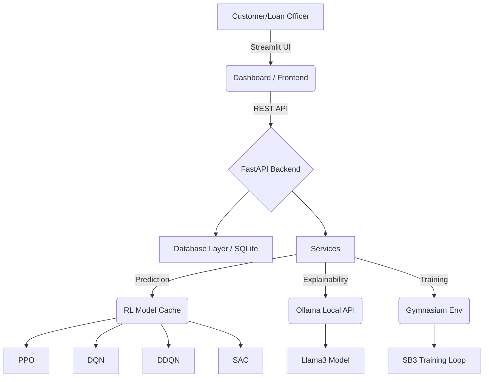
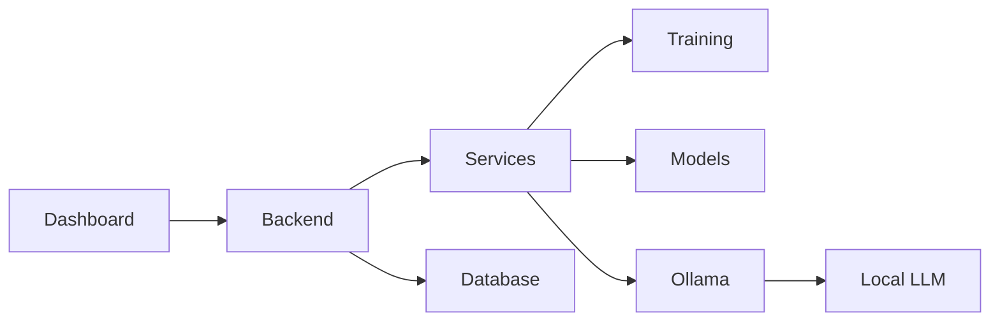
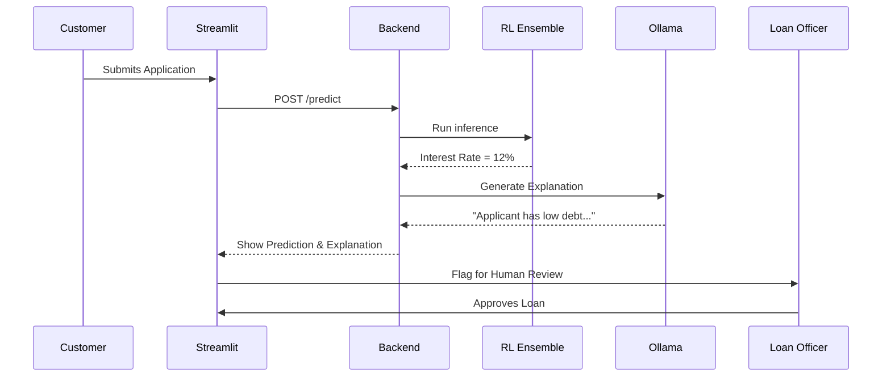

# Enterprise AI Dynamic Loan Pricing Platform
**Developer & End-User Documentation Suite**

---

## 1. Updated Architecture Diagram



---

## 2. Folder Structure

```text
d:\RL project\dynamic-loan-pricing\
├── backend/            # FastAPI initialization and API routers
├── frontend/           # UI assets, CSS, images
├── dashboard/          # Streamlit multi-page apps (Home, Processing, Review, etc.)
├── models/             # Saved RL model weights (.zip)
├── database/           # SQLAlchemy models, SQLite connection, schemas
├── services/           # Core business logic (Prediction Service, Loan Logic)
├── training/           # RL Gym environment and training scripts
├── analytics/          # Plotly chart generation
├── agents/             # Workflow orchestrators
├── ollama/             # Ollama API clients (Explainability, Chatbot)
├── monitoring/         # System metrics
├── chatbot/            # RAG implementation
├── utils/              # Helper functions (Auth, Sanitization)
├── config/             # Centralized settings
├── logs/               # Application log files
├── reports/            # Generated output files
└── datasets/           # CSV data
```

---

## 3. API Documentation

| Endpoint | Method | Description |
|---|---|---|
| `/api/predict` | `POST` | Accepts applicant JSON, returns RL ensemble predictions + Ollama explanation. |
| `/api/train` | `POST` | Triggers background SB3 training for a specified model. |
| `/api/models` | `GET` | Returns loaded models status (in-memory cache). |
| `/api/dashboard`| `GET` | Returns high-level KPIs for the home screen. |
| `/api/applications`| `GET` | Returns ledger of pending/processed applications. |
| `/api/loan-decisions`| `POST` | Saves Human-in-the-Loop decision overrides. |

---

## 4. Module Dependency Graph



---

## 5. User Flow Diagram



---

## 6. Class Diagram

*   **LoanApplication:** Age, Gender, Income, Debt, Region, Collateral, Education
*   **RLPrediction:** PPO_rate, DQN_rate, DDQN_rate, SAC_rate, best_model, risk_score
*   **LoanDecision:** decision (Approve/Reject), final_rate, comments

*(Relationships: LoanApplication 1:1 RLPrediction 1:1 LoanDecision)*

---

## 7. Sequence Diagrams

*(See User Flow Diagram)*

---

## 8. Deployment Guide (Without Docker)

1.  **Prerequisites:** Python 3.10+, PowerShell, local instance of Ollama (`llama3` pulled).
2.  **Install Dependencies:** `pip install -r requirements.txt`
3.  **Start Services:** Execute `.\run.ps1`
4.  **Ollama:** Ensure `ollama serve` is running on port 11434.

---

## 9. Developer Documentation

*   **Modifying RL Models:** Do not change the 10-feature state vector without updating `loan_env.py` and retraining all `.zip` models.
*   **Adding Streamlit Pages:** Add new scripts to `dashboard/views/`, register them in `PAGE_REGISTRY` inside `utils/auth.py` (with the `roles` allowed to see them), and keep the in-page `require_role()` guard as defense-in-depth.

---

## 10. End-User Documentation

*   **Customer:** Apply for a loan, receive instant AI estimation, wait for final officer approval.
*   **Loan Officer:** Review AI recommendations on the "Human Review" page. Use the "What-If Simulator" to test edge cases.

---

## 11. Future Roadmap

*   Implement fully fledged RAG indexing for PDFs.
*   Migrate to cloud-hosted Llama3 endpoints if local hardware limits scale.
*   Introduce DDPG and TD3 architectures.

---

## 12. Code Quality Report

*   Type hints added to all Pydantic schemas.
*   Modular, decoupled clean architecture applied.
*   Global `sanitize_nill()` function ensures no `null` values reach the frontend.

---

## 13. Performance Optimization Report

*   **Model Caching:** RL `.zip` files are now cached in RAM via `prediction_service.py` to eliminate disk I/O latency.
*   **Ollama Speed:** API requests to Ollama are non-streaming for predictions to ensure atomic JSON loading, but streaming for the chatbot for better UX.

---

## 14. Security Recommendations

*   Add JWT Authentication to the FastAPI backend.
*   Implement SQL Injection protection beyond SQLAlchemy's default parameterization if raw queries are introduced.
*   Ensure the local Ollama instance port (11434) is blocked from external internet traffic.
